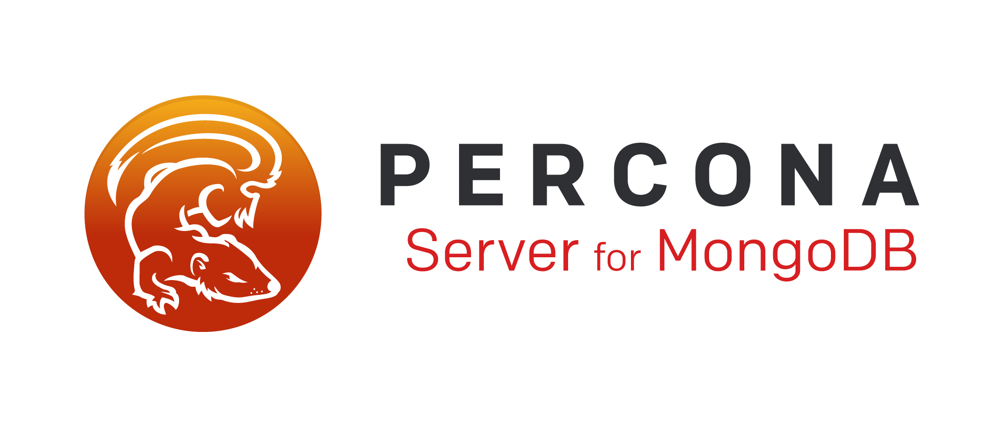

Percona Server for MongoDB Operator
===================================

{: .align-center}

With the appearance of container orchestration systems, managing containerized database clusters have reached the new level of automation. The Kubernetes and the OpenShift platform based on it have enriched the relatively new config-driven deployment approach with a set of such strong features, as scaling on demand, self-healing, and high availability. These features are achieved by relatively-simple *controllers*, operating in the Kubernetes environment as declared in correspondent configuration files: they create different objects (including containers or container groups called pods) to do some job, listen for events and take actions based on them (re-create, delete, etc.).

Still the cost of this power is the complexity of the underlying container-based architecture, and, consequently, non-trivial level of automation, makes it even more complex for the stateful applications, such as databases. A *Kubernetes Operator* is a special type of the controller introduced to simplify the complex deployments of a specific application, extending the Kubernetes API with a new *Custom Resources* to deploy, configure, and manage the application. You can compare Kubernetes Operator to System Administrator who deploys the application and watches the Kubernetes events related to it, taking administrational/operational actions when needed.

The percona-server-mongodb-operator is an application-specific controller created to effectively deploy and manage *Percona Server for MongoDB* in Kubernetes or OpenShift environment.
